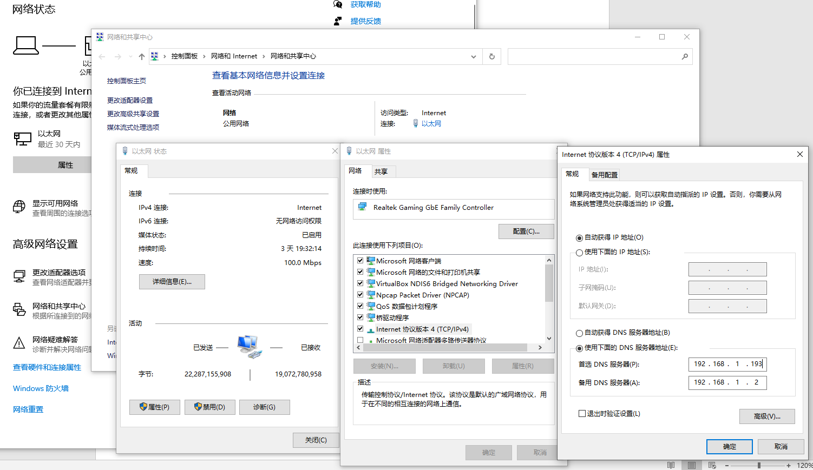

# 前言
本文档是CloudFoundry调研系列文档，为部署文档之一。

# 概述

## 简介
本文档是对CloudFoundry在k8s集群部署进行调研，编写文档的目的是让读者能够快速地在自己的环境里部署CloudFoundry系统。
本文试图保持部署过程在开发环境和生产环境的一致性。

## 简介
Kubernetes原生CloudFoundry发行版kubecf是CF应用运行时（CFAR）的k8s发行版。它为开发人员提供生产力，并允许平台操作员使用Kubernetes工具和API管理基础架构抽象。
kubecf是CloudFoundry在k8s平台部署的发行版之一。另外有发行版CF for K8S，本文主要探讨kubecf部署。

## 系统需求

### 虚拟机需求
- 磁盘1：80G，操作系统，k8s系统
- 磁盘2：100G，NFS
- 内存：20G
- CPU ：4
- 操作系统：CentOS 7.9 升级到最新更新， 内核升级到5.9.11
- 说明：虚拟机可以是VirtualBox，KVM，VMware等

### 域名服务
- 可修改配置的域名服务器 （参考附录）

### 镜像服务（推荐）
- 为了加快重复安装速度，推荐配置自己本地docker镜像服务器

# 安装

## 域名服务设置
在域名服务器中设置记录，指向CloudFoundry，参考附录 域名服务设置，比如添加：
```
192.168.1.62 registry.xyz.com     # docker 镜像服务器
192.168.1.71 xmchen.xyz.com       # 本地共享资源
192.168.1.27 *.xyz.com            # 其他路由到VM，比如k8s dashboard，CF 相关服务
其中：192.168.1.27 为VM地址
```
## 配置和安装

### 安装虚拟机
本文以VirtualBox上安装虚拟机为例：
创建一个20G内存，带两个磁盘80G+100G，4个CPU的Linux 64位虚拟机，安装CentOS7.9系统。网络选择桥接网卡模式，选择最小安装和缺省磁盘分区。

### 配置虚拟机

#### 配置网络
从某个版本开始，RedHat系列采用了统一的网卡命名方式，为了适应以后系统可能使用的网卡名字ethx，推荐修改网卡名字从enp0s3 到eth0。
建议使用静态IP，修改完后重启系统。

编辑/etc/default/grub，加"net.ifnames=0"部分，然后运行命令
```
GRUB_CMDLINE_LINUX="crashkernel=auto rd.lvm.lv=centos/root rd.lvm.lv=centos/swap net.ifnames=0 rhgb quiet"
grub2-mkconfig -o /boot/grub2/grub.cfg
```
修改网卡脚本
```
sed -i 's/enp0s3/eth0/g;' /etc/sysconfig/network-scripts/ifcfg-enp0s3
mv /etc/sysconfig/network-scripts/ifcfg-enp0s3 /etc/sysconfig/network-scripts/ifcfg-eth0
sed -i 's/BOOTPROTO.*/BOOTPROTO=static/g; s/ONBOOT=.*/ONBOOT=yes/g' /etc/sysconfig/network-scripts/ifcfg-eth0
cat <<EOF >> /etc/sysconfig/network-scripts/ifcfg-eth0
IPADDR=192.168.1.27
NETMASK=255.255.255.0
GATEWAY=192.168.1.2
EOF
reboot
```
指定自己的DNS
```
cat <<EOF > /etc/resolv.conf
search .xyz.com
nameserver 192.168.1.193
EOF
```

#### 更新包以及内核
这里使用本地库或者国内镜像
```
cd /etc/yum.repos.d
mkdir back
mv CentOS*.repo back
curl -o /etc/yum.repos.d/centos7_tuna.repo http://xmchen.xyz.com/share/misc/centos7_tuna.repo
```

升级包，以及内核到5.9.11
```
yum update -y
rm -rf / etc/yum.repos.d/CentOS-*

curl -o /etc/yum.repos.d/bintray7.repo http://xmchen.xyz.com/share/misc/bintray7.repo
yum install kernel-ml
grub2-mkconfig -o /boot/grub2/grub.cfg
```
重启系统，确保已经是5.9.11内核，如果不是，在启动菜单选择，启动后可以删除老版本内核。
```
yum erase kernel-tools-libs kernel kernel-tools
```

#### 安全以及内核参数
调整内核参数
```
cat <<EOF >> /etc/sysctl.conf
net.bridge.bridge-nf-call-iptables=1
user.max_user_namespaces = 15076
EOF
sysctl -p
```

清除防火墙
```
yum install iptables-services -y
iptables -F
iptables -X
iptables -F -t nat
iptables -X -t nat
service iptables save
systemctl stop iptables.service
systemctl disable iptables.service
systemctl disable firewalld
systemctl stop firewalld
```
关闭 selinux
```
sed -i.bak --follow-symlinks 's/SELINUX=.*/SELINUX=disabled/g' /etc/sysconfig/selinux
```
关闭 swap
```
sed -i.bak 's/\/.*swap.*/#&/g' /etc/fstab
```
重启系统，检查以上配置都有效。

#### 配置主机名以及无密码登录
```
ssh-keygen
cd ~/.ssh
cat id_rsa.pub >> authorized_keys
echo “192.168.1.27 softway4” >> /etc/hosts
hostnamectl set-hostname softway4
ssh softway4
```

### 安装docker-ce
安装 docker-ce
```
# 如果没有，下载本地repo文件
curl -o /etc/yum.repos.d/bintray7.repo http://xmchen.xyz.com/share/misc/bintray7.repo
yum install docker-ce
```

### 安装kubernetes
```
# 如果没有，下载本地国内epel repo文件
curl -o /etc/yum.repos.d/epel7_tuna.repo http://xmchen.xyz.com/share/misc/epel7_tuna.repo
yum install kubernetes-kubeadm kubernetes
```

### 安装ansible，rsync，ksh等工具
```
yum insall ansible rsync net-tools bind-utils ksh
```

### 配置k8s单机集群
下载k8s集群安装的ansible playbook： https://github.com/soft-way/readme，并拷贝kubernetes/ansible到~。
修改以下文件，然后运行命令：
```
~/ansible/group_vars/all
~/ansible/inventory/1nodes.inv
~/ansible/roles/env_prepare/files/root_ca.crt
~/ansible/roles/dashboard_setup/files/pki/dashboard.crt
~/ansible/roles/dashboard_setup/files/pki/dashboard.key
说明：有关证书生成参考附录 自签名证书生成
```

修改 ~/ansible/group_vars/all
```
kubernetes_version: v1.19.4
pause_version: 3.2
dashboard_version: v2
control_plane_endpoint: 192.168.1.27
bind_port: 6443
pod_subnet: 172.18.0.0/16
service_subnet: 10.96.0.0/12
cluster_dns: 10.96.0.10 
cluster_domain: xyz.com
k8s_install_root: /var/log/k8s
k8s_image_repo: registry.xyz.com/k8s_gcr_io
utils_image_repo: registry.xyz.com/docker_io
calico_nic: eth0
```
准备 ~/ansible/inventory/1nodes.inv 
```
[master]
softway4

[worker]
```
运行安装命令
```
ansible-playbook -i ~/ansible/inventory/1nodes.inv ~/ansible/k8s_setup.yml
```

### 配置k8s 存储类

#### 第二块磁盘建立一个主分区(fdisk/parted)
```
parted /dev/sdb mkpart primary xfs 0% 100%
mkfs.xfs /dev/sdb1
echo "/dev/sdb1               /srv                    xfs     defaults        0 0" >> /etc/fstab
mount -a
```

#### 配置master节点可以部署pods：
```
kubectl taint nodes --all node-role.kubernetes.io/master-
```

#### 安装 nfs 存储类
使用代码：https://github.com/kubernetes-sigs/nfs-ganesha-server-and-external-provisioner
修改镜像位置以及class名字：

修改 deploy/kubernetes/deployment.yaml
```
          image: registry.xyz.com/quay_io/external_storage/nfs-ganesha-server-and-provisioner:v1.0.8
            - "-provisioner=xyz.com/nfs"
```
修改 deploy/kubernetes/class.yaml：
```
  name: xyz-nfs
provisioner: xyz.com/nfs
```

创建存储类
```
kubectl create -f deploy/kubernetes/deployment.yaml
kubectl create -f deploy/kubernetes/rbac.yaml
kubectl create -f deploy/kubernetes/class.yaml
```
创建测试PVC
```
kubectl create -f deploy/kubernetes/claim.yaml
```
设置为缺省存储类：
```
kubectl patch storageclass xyz-nfs -p '{"metadata": {"annotations":{"storageclass.kubernetes.io/is-default-class":"true"}}}'
```

### 安装kubecf
检出代码，以版本2.6.1为例：
```
https://github.com/cloudfoundry-incubator/kubecf/releases/download/v2.6.1/kubecf-bundle-v2.6.1.tgz
```
解开文件，做一些定制：
```
mkdir kubecf-bundle-v2.6.1
cd kubecf-bundle-v2.6.1
tar -zxf ../kubecf-bundle-v2.6.1.tgz
tar -zxf cf-operator.tgz
tar -zxf kubecf_release.tgz
```

#### 修改pvc尺寸：
修改 kubecf/assets/cf-deployment.yml
```
794c794
<   persistent_disk_type: 100GB
---
>   persistent_disk_type: 10GB
```
修改 kubecf/assets/operations/instance_groups/app-autoscaler.yaml
```
100c100
<     persistent_disk: 20480 # 20GB
---
>     persistent_disk: 10240 # 10GB
```
修改 kubecf/assets/operations/instance_groups/singleton-blobstore.yaml
```
12c12
<   value: 102400 # 100GB
---
>   value: 20480 # 20GB
```

#### 使用本地镜像服务器
修改 kubecf/config/sle15.yaml
```
<         url: registry.suse.com/cap-staging
---
>         url: registry.xyz.com/registry_suse_com/cap-staging
```
修改 kubecf/config/releases.yaml
```
10c10
<     url: docker.io/cfcontainerization
---
>     url: registry.xyz.com/docker_io/cfcontainerization
19c19
<       repository: ghcr.io/cfcontainerizationbot/kubecf-apps-dns
---
>       repository: registry.xyz.com/ghcr_io/cfcontainerizationbot/kubecf-apps-dns
45c45
<       repository: docker.io/cfcontainerization/pxc
---
>       repository:  registry.xyz.com/docker_io/cfcontainerization/pxc
46a47,48
>       pullPolicy: IfNotPresent
>
```
修改 cf-operator/charts/quarks-secret/values.yaml
```
13c13
<   org: cfcontainerization
---
>   org: registry.xyz.com/docker_io/cfcontainerization
```

修改 cf-operator/charts/quarks-job/values.yaml
```
16c16
<   org: cfcontainerization
---
>   org: registry.xyz.com/docker_io/cfcontainerization
```

#### 使用定制的helm values.yaml
准备 ./kubecf-values.yaml
```
system_domain: cf1.xyz.com

install_stacks: [sle15]

services:
  router:
    externalIPs: [192.168.1.27]

sizing:
  database:
    persistence:
      size: 10Gi

  diego_cell:
    ephemeral_disk:
      # Size of the ephemeral disk used to store applications in MB
      size: 20480

resources:
  diego-cell:
    garden:
      garden: {memory: {limit: 131072, request: 8}}

testing:
  smoke_tests:
    enabled: false
```

准备 cf-operator-values.yaml
```
cluster:
  domain: "xyz.com"

image:
  repository: docker_io/cfcontainerization/cf-operator
  org: registry.xyz.com

operator:
  boshDNSDockerImage: "registry.xyz.com/docker_io/cfcontainerization/coredns:0.1.0-1.6.7-bp152.1.19"
```

#### 运行命令
创建命名空间
```
kubectl create namespace cf-operator
```

创建cf-operator应用
```
helm install cf-operator \
  --namespace cf-operator \
  --set "global.singleNamespace.name=kubecf" \
  --values cf-operator-values.yaml \
  cf-operator \
 --wait
```
创建kubecf应用
```
helm install kubecf \
  --namespace kubecf \
  --values kubecf-values.yaml \
  kubecf
```

# 测试使用

## 下载cf-cli
从以下地址下载cf客户端，Windows 或者Linux版本：
```
https://github.com/cloudfoundry/cli/blob/master/doc/installation-instructions/installation-instructions-v7.md#installers-and-compressed-binaries
```

## 登录
在Windows或者Linux下使用cf客户端登录
```
cf api --skip-ssl-validation https://api.cf1.xyz.com
admin_pass=$(kubectl get secret -n kubecf var-cf-admin-password -o jsonpath='{.data.password}' | base64 --decode)
cf auth admin $admin_pass
```

## 组织空间以及用户
```
cf create-org softway
cf create-space -o softway staging
cf create-user xmchen xmchen123
cf set-org-role xmchen softway OrgManager
cf set-space-role xmchen softway staging SpaceManager
cf set-space-role xmchen softway staging SpaceDeveloper
cf set-space-role xmchen softway staging SpaceAuditor
```

## 测试应用
```
git clone https://github.com/cloudfoundry-samples/cf-ex-php-info.git
cd cf-ex-php-info
cf auth xmchen xmchen123
cf target -o softway -s staging
cf push
```
测试网站，访问：https://cf-ex-php-info.cf1.xyz.com


# 附录
## 域名服务配置
### Windows下的Arcylic配置
### 服务器端配置
本文以Windows下域名服务器Arcylic为例，Linux下可以推荐使用dnsmasq。下载地址https://sourceforge.net/projects/acrylic/
安装之后，打开Acylic UI进行配置，需要的配置如下：
File + Open Arcylic Configuration，添加如下，然后保存。
```
[AllowedAddressesSection]
IP1=192.168.*
```
File + Open Arcylic Hosts，添加如下，然后保存
```
192.168.1.27 *.cf1.xyz.com        # 这里192.168.1.27是安装kubecf虚拟机的IP
192.168.1.62 registry.xyz.com     # docker 镜像服务器
192.168.1.71 xmchen.xyz.com       # 资源共享服务器
192.168.1.27 k8s-softway4.xyz.com # k8s 集群dashboard
```
添加防火墙规则，管理员运行如下命令：
```
netsh advfirewall firewall add rule name="Allow DNS UDP" dir=in action=allow protocol=UDP localport=53
```
Linux下使用dnsmasq，参考相应文档。

### 客户端配置
设置客户端以使用新配置的域名服务器访问集群。以Windows设置为例，打开网络和Internet设置，进入网络和共享中心，选择网卡，点击属性，进入Internet协议版本 4 （TCP/ipv4）,  常规，使用自己的DNS，添加 DNS服务器地址，这里是填写自己设置域名服务器的IP地址。




## 自签名证书生成
步骤：
1. 产生CA key
```
openssl genrsa -out root_ca.key 4096
```
2. 产生CA 证书
```
openssl req -new -x509 -sha256 -days 3650 -key root_ca.key -out root_ca.crt -config <(cat rootca.csr.cnf) -extensions v3_req

# 其中rootca.csr.cnf内容：
[req]
default_bits = 4096
prompt = no
default_md = sha256
distinguished_name = dn

[v3_req]
basicConstraints = CA:TRUE
keyUsage = nonRepudiation, digitalSignature, keyEncipherment, cRLSign, keyCertSign

[dn]
C=CN
ST=Beijing
L=SD
O=XYZ
OU=DX
emailAddress=cloudteam@xyz.com
CN = XYZ CloudAdmin
```
3. 产生服务key
```
openssl genrsa -out server.key 2048
```
4. 产生服务证书csr
```
openssl req -new -key server.key -out server.csr -config <( cat server.csr.cnf )

# 其中server.csr.cnf内容：
[req]
default_bits = 2048
prompt = no
default_md = sha256
distinguished_name = dn

[dn]
C=CN
ST=Beijing
L=SD
O=XYZ
OU=DX
emailAddress=xuming.chen@xyz.com
CN = XYZ
```
5. 签名服务证书
```
openssl x509 -req -days 3650 -in server.csr -CA root_ca.crt -extfile server_v3.ext -CAkey root_ca.key -set_serial 0101 -out server.crt -sha256

# 其中server_v3.ext内容：
authorityKeyIdentifier=keyid,issuer
basicConstraints=CA:FALSE
keyUsage = digitalSignature, nonRepudiation, keyEncipherment, dataEncipherment
subjectAltName = @alt_names

[alt_names]
DNS.1 = *.xyz.com
IP.1 = 192.168.1.27
```
6. 查看服务证书
```
openssl x509 -noout -text -in server.crt
```
7. 验证服务证书
```
openssl verify -CAfile root_ca.crt server.crt
```

## Docker镜像服务设置
参考附录 生成自签名服务器证书，放到/certs目录
指定一个独立存放镜像目录，运行命令：
```
docker run -d --restart=always --name registry \
    -v /registry:/var/lib/registry -v /certs:/certs -e REGISTRY_HTTP_ADDR=0.0.0.0:443 \
     -e REGISTRY_HTTP_TLS_CERTIFICATE=/certs/server.crt -e REGISTRY_HTTP_TLS_KEY=/certs/server.key -p 443:443 registry
```

# 参考文献
### [Cloud Foundry – Open Source Cloud Native Application Delivery](https://www.cloudfoundry.org/)
### [KubeCF](https://kubecf.io/)

# 术语和缩略语

+ CFAR（Cloud Foundry Application Runtime）

  CloudFoundry应用运行时接口，是CloudFoundry定义的符合CloudFoundry平台的一组应用规范。
```
